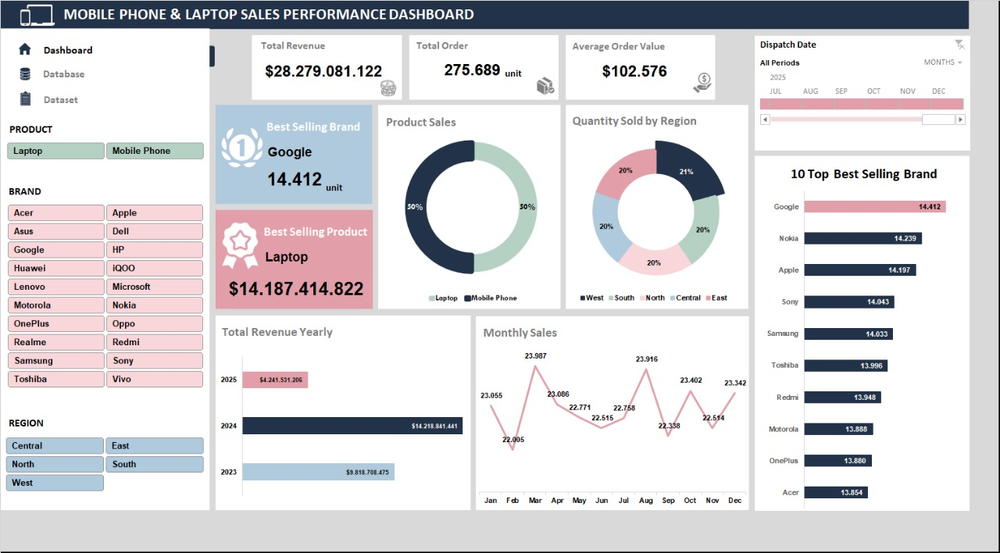

# 📊 Sales Performance Dashboard – Mobile Phones & Laptops

This dashboard is built using **Microsoft Excel** to analyze the sales performance of **Mobile Phones** and **Laptops**.

## 🧩 Key Features
- Total sales summary
- Sales by product and brand
- Analysis by region (area)
- Visualization of monthly sales trends
- Interactivity with **slicer**, **pivot table**, and **pivot chart**

## 🛠 Tools Used
-Microsoft Excel
- Pivot Tables & Pivot Charts
- Slicer
- Conditional Formatting

## 📷 Dashboard Preview

## 📌 Key Insights
- Total revenue $28.2 billion.
- Number of products sold 275,689 units.
- The brand with the highest sales is Google (14,412 units), followed by Nokia and Apple.
- The highest sales occurred in 2024 ($14.2 billion), indicating the company's maximum performance.
- The region with the highest sales is the west (21%), followed by other regions, each contributing around 20%.

## 🎯 Project Objectives
This project is part of a portfolio to demonstrate the ability to:
- Data visualization using Excel
- Sales trend analysis
- Interactive dashboard creation

## 📎 Note
The data used is taken from kaggle.com and is for learning and portfolio purposes only.
